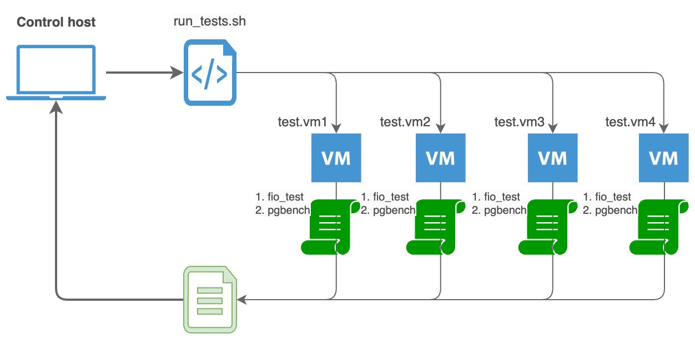

# Тестирование производительности дисковой подсистемы виртуальных машин с помощью утилиты fio и встроенного бенчмарка PostgreSQL

## Архитектура стенда
- **Управляющая машина**: Control host (MacBook или любой другой хост с набором скриптов управления процессом тестирования и доступом к вирт машинам в ДЦ)
- **Тестовые машины**: от 1 до 4 виртуальных машин под управлением ОС Debian 12, установленными fio, PostgreSQL 17 и python3, которые отвечают требованиям в `TESTING_METHOD.md`
- **Сценарий тестирования**: Тест fio → Тест pgbench → сбор метрик → анализ и визуализация результатов

- **Сетевое хранилище iSCSI**: подключается к сетевому ядру и используются следующие IP адреса - 10.85.104.[203-204] для mgmt сети и адреса 10.85.109.[10-18] для подключения iSCSI к vSphere

## Быстрый старт
1. Настройка тестовых виртуальных машин согласно  требований `TESTING_METHOD.md`
2. Запуск тестов на control host (MacBook или другой хост поддерживающий bash):
   + Скрипт будет запрашивать у пользователя:
      + Количество ВМ (1-4)
      + IP-адреса каждой ВМ
      + Тип теста (только fio, только pgbench, или оба варианта тестов)
      + Количество итераций (рекомендуется 3 прохода тестов для статистической значимости)
      + Параметры fio (опционально, по умолчанию: 10G, 4k, 60% записи, глубина очереди 64)
      ```bash
      ./control/run_tests.sh
      ```
3. Обработка результатов после завершения тестов:
   + Скрипт `run_tests.sh` автоматически сохранит результаты в структурированные папки:
   ```bash
   results/
   ├── 20251107_1430_storage1_1VM_3iter/
   │   ├── iter1/
   │   ├── iter2/
   │   └── iter3/
   ├── 20251107_1500_storage1_2VMs_3iter/
   │   ├── iter1/
   │   ├── iter2/
   │   └── iter3/
   └── ... 
   ```
   + Агрегация результатов (объединение данных из нескольких итераций):
   ```bash
   python3 aggregate_results.py results/20251107_1430_storage1_1VM_3iter
   ```
   Скрипт создаст файлы `aggregated_report.json` и `aggregated_report.txt`, содержащие средние значения и стандартные отклонения по всем итерациям.

   + Визуализация результатов (сравнение между конфигурациями):
   ```bash
   python3 visualize_results.py results/*/aggregated_report.json
   ```
   Этот скрипт сгенерирует графики в папке `visualization_output/`, включая:
      + Сравнение IOPS, Bandwidth и Latency между конфигурациями
      + Графики TPS и задержек pgbench
      + Анализ масштабируемости при увеличении количества ВМ

4. Пример полного workflow:
   ```bash
   # Тест на хранилище 1 (1 ВМ, 3 итерации)
   ./control/run_tests.sh
   # → выбрать 1 ВМ, 3 итерации

   # Тест на хранилище 1 (2 ВМ, 3 итерации)
   ./control/run_tests.sh
   # → выбрать 2 ВМ, 3 итерации

   # Тест на хранилище 1 (4 ВМ, 3 итерации)
   ./control/run_tests.sh
   # → выбрать 4 ВМ, 3 итерации

   # Переносим ВМ на хранилище 2
   # Повторяем тесты...

   # Агрегируем все результаты
   python3 aggregate_results.py results/20251107_1430_storage1_1VM_3iter
   python3 aggregate_results.py results/20251107_1500_storage1_2VMs_3iter
   python3 aggregate_results.py results/20251107_1530_storage1_4VMs_3iter
   python3 aggregate_results.py results/20251107_1600_storage2_1VM_3iter
   # ... и так далее для всех тестов

   # Визуализируем сравнение
   python3 visualize_results.py results/*/aggregated_report.json
   ```

5. Полученные результаты:
   + Визуализированные графики будут сохранены в `visualization_output/`
   + Отчеты агрегированных данных будут в `results/*/aggregated_report.*`
   + Оригинальные данные тестов останутся в подпапках `results/`

   Этот процесс позволяет:
      + Получить статистически значимые результаты через многократные итерации
      + Сравнить производительность различных конфигураций
      + Проанализировать масштабируемость системы при увеличении числа ВМ
      + Выявить оптимальную конфигурацию хранилища для PostgreSQL


   