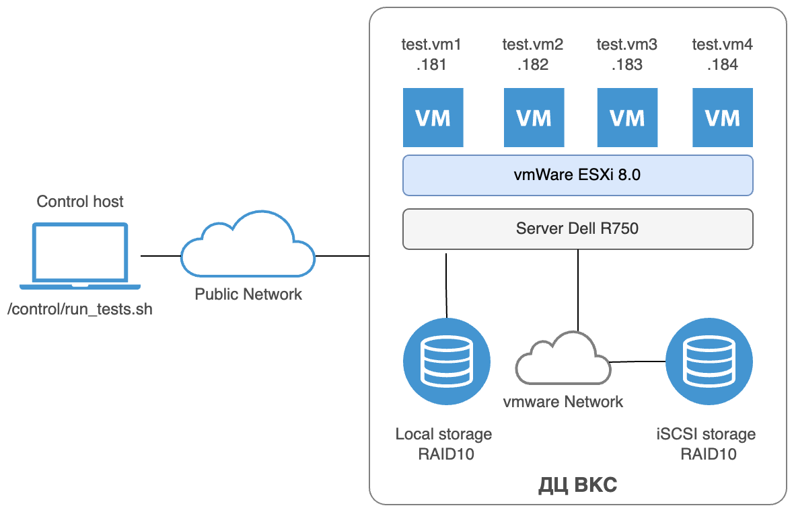

## Методика тестирования производительности PostgreSQL 17 на локальном и iSCSI-хранилище
## Контроль версий документа
| Версия | Дата |
|:-------|:-----|
| 1.1 | 22 октября 2025 |
| 1.2 | 23 октября 2025 |
| 1.3 | 06 ноября 2025 |

## 	Цель: Сравнить производительность дисковой подсистемы и СУБД PostgreSQL 17 при размещении ВМ на локальном RAID10 (Dell R750) и на внешнем iSCSI-СХД, подключённом по 25/100GbE в среде VMware vSphere 8.

## 1. Общие положения
Тестирование проводится на одном хосте ESXi в кластере Т4 ДЦ ВКС.

Сравниваются два типа хранилищ:
+ Локальный: VMFS на RAID10, собранный из 8 локальных дисков на хосте Dell R750.
+ Сетевой: VMFS на выделенном LUN iSCSI-СХД (без фоновой нагрузки).

Все ВМ идентичны и работают под управлением ОС Debian 12.

Тесты включают:
+ Низкоуровневую нагрузку (fio, 60 сек на тест)
+ Прикладную нагрузку (pgbench)

Используем следующие сценарии:
+ 1 ВМ;
+ 4 ВМ одновременно на одном хосте;
+ Возможны промежуточные варианты из вышеперечисленных при необходимости;
+ Кол-во тестовых машин и их IP адреса выбираются при запуске скрипта  `/control/run_tests.sh` контрольном хосте.

Скрипт `/control/run_tests.sh` выполняет следующие действия:
+ Запрашивает количество VM для теста и их IP;
+ Запускает тесты одновременно на всех VM;
+ Собирает результаты тестов.

### Тест fio
Тест состоит из 5 этапов:
+ последовательное чтение блоками по 4К (или как задано в параметрах теста при запуске);
+ последовательная запись блоками по 4К (или как задано в параметрах теста при запуске);
+ случайное чтение;
+ случайная запись;
+ смешанный тест на чтение и запись одновременно (смешанная нагрузка (mixed RW): 60% запись / 40% чтение).

### Тест pgbench
Тест состоит из двух этапов:
+ **Инициализация тестовой базы данных** — создаётся схема pgbench с масштабируемым объёмом данных (по умолчанию scale=100, ~15 ГБ), включающая таблицы счетов, отделений, истории и т.д.
+ **OLTP-нагрузочный тест** — эмулирует параллельную работу множества клиентов, выполняющих типичные транзакции:
    + выборка баланса счёта,
    + обновление баланса,
    + вставка записи в историю.
По умолчанию: 32 клиента, 4 потока, длительность 600 секунд.

## 2. Архитектура тестирования


### Участники
+ **Контрольный хост**: MacBook Pro (или любой Linux-хост)  
  → запускает тесты, собирает и анализирует результаты.
+ **Тестовые ВМ**: 1–4 машины с Debian 12 в ДЦ (IP: `10.85.105.181–184`)  
  → выполняют `fio` и `pgbench`, не участвуют в управлении.

### Сеть
+ Доступ к ДЦ — через **VPN-туннель**
+ Подключение к ВМ — по **SSH с ключами** (без пароля)
+ Все скрипты и результаты хранятся на **контрольном хосте**


## 3. Конфигурация виртуальных машин
| Параметр  | Значение |
|:-----------|:--------------|
| ОС		| Debian 12 (bookworm) |
| vCPU		| 4	ядра		|
| RAM		| 16 ГБ		|
| Системный диск ОС | 30 ГБ, Thick Eager Zeroed |
| Диск данных PostgreSQL | 50 ГБ, отдельный VMDK, Thick Eager Zeroed, контроллер PVSCSI |
| Файловая система системного диска | btrfs |
| Файловая система данных | XFS (noatime, logbufs=8, logbsize=256k) |
| Swap | Отключён |
| Сетевой адаптер | VMXNET3 |
> Диск данных монтируется в /mnt/pgdata и используется как PGDATA


## 4. Подготовка ВМ
### 4.1 Базовая настройка ОС
```bash
sudo apt update && sudo apt upgrade -y
sudo apt install -y wget ca-certificates sysstat dstat htop xfsprogs python3 fio

# Отключение swap
sudo swapoff -a
sudo sed -i '/ swap / s/^/#/' /etc/fstab

# Настройка ядра
cat <<EOF | sudo tee -a /etc/sysctl.conf
vm.swappiness = 1
vm.overcommit_memory = 2
kernel.shmmax = 4294967296
kernel.shmall = 1048576
EOF
sudo sysctl -p

# Лимиты
cat <<EOF | sudo tee -a /etc/security/limits.conf
* soft nofile 65536
* hard nofile 65536
postgres soft nofile 65536
postgres hard nofile 65536
EOF

sudo reboot
```

### 4.2 Настройка диска под PostgreSQL
```bash
sudo mkdir -p /mnt/pgdata
echo '/dev/sdb /mnt/pgdata xfs defaults,noatime,logbufs=8,logbsize=256k 0 0' | sudo tee -a /etc/fstab
sudo mount -a
```

### 4.3 Установка PostgreSQL 17
```bash
# Добавление официального репозитория
wget --quiet -O - https://www.postgresql.org/media/keys/ACCC4CF8.asc | sudo gpg --dearmor -o /etc/apt/trusted.gpg.d/postgresql.gpg
echo "deb https://apt.postgresql.org/pub/repos/apt/ bookworm-pgdg main" | sudo tee /etc/apt/sources.list.d/pgdg.list

sudo apt update
sudo apt install -y postgresql-17 postgresql-client-17 postgresql-contrib-17
sudo chown postgres:postgres /mnt/pgdata
```

### 4.4 Настройка PostgreSQL 17
```bash
sudo systemctl stop postgresql

# Инициализация на новом томе
sudo -u postgres initdb -D /mnt/pgdata

# Указать PGDATA
sudo sed -i "s|data_directory = '.*'|data_directory = '/mnt/pgdata'|" /etc/postgresql/17/main/postgresql.conf

# Добавить настройки производительности в /mnt/pgdata/postgresql.conf
cat <<EOF | sudo tee -a /mnt/pgdata/postgresql.conf

# === Performance Tuning ===
shared_buffers = 4GB
effective_cache_size = 12GB
work_mem = 64MB
maintenance_work_mem = 1GB

wal_level = replica
max_wal_size = 8GB
min_wal_size = 2GB
checkpoint_timeout = 30min
checkpoint_completion_target = 0.9

max_connections = 200
max_worker_processes = 4
max_parallel_workers_per_gather = 2
max_parallel_workers = 4

log_min_duration_statement = 1000
log_statement = 'none'
EOF


# Инициализируем кластер PostgreSQL
sudo -u postgres /usr/lib/postgresql/17/bin/initdb -D /mnt/pgdata

# Создаем override для службы
sudo mkdir -p /etc/systemd/system/postgresql@17-main.service.d
sudo vim /etc/systemd/system/postgresql@17-main.service.d/override.conf

# Вставить в файл
[Service]
Environment=PGDATA=/mnt/pgdata

# Разрешить подключения (только для тестов!)
echo "local all all trust" | sudo tee /mnt/pgdata/pg_hba.conf
echo "host all all 0.0.0.0/0 trust" | sudo tee -a /mnt/pgdata/pg_hba.conf

sudo systemctl start postgresql@17-main
sudo systemctl enable postgresql@17-main

# Поверяем версию PostgreSQL
sudo -u postgres psql -c "SELECT version();"
```
Для автоматизации процесса деплоя PostgreSQL 17 кластера можно запустить скрипт `scripts/setup_postgresql_cluster.sh`

### 4.5 Проверка готовности VM
Перед запуском тестов на всех VM необходио провести проверку готовности к тестам с помощью скрипта:
```bash
./scripts/verify_test_env.sh
```

## 5. План тестирования
| Этап | Тип хранилища | Кол-во в тесте | Тип нагрузки | Кол-во повторов тестов |
|:-----|:--------------|:---------------|:-------------|:-----------------------|
|1 | Локальное | 1 | скрипт fio (60 сек) | 	3 |
|2 | Локальное | 4 | скрипт fio (параллельно 4 VM) | 3|
|3 | Локальное | 1 | pgbench | 3 |
|4 | Локальное | 4 | pgbench (параллельно 4 VM) | 3 |
|5 | iSCSI | 1 | скрипт fio (60 сек) | 3 |
|6 | iSCSI | 4 | скрипт fio (параллельно 4 VM) | 3 |
|7 | iSCSI | 1 | pgbench | 3 |
|8 | iSCSI | 4 | pgbench (параллельно 4 VM) | 3|

> Перед каждым тестом выполняем команды:
```bash
sudo sh -c "echo 3 > /proc/sys/vm/drop_caches"
sudo systemctl restart postgresql@17-main
```
На локальном хранилище выполняются этапы 1-4, после миграции на сетевое хранилище iSCSI выполняются этапы 5-8 из плана тестирования.

## 6. Нагрузочные тесты
### 6.1 Использование утилиты fio в Python скрипте
Используется скрипт test_fio_7.py с параметрами:

+ --runtime=60 --time_based
+ --rwmixwrite=60 (60% запись)
+ --size=10G, --bs=4k, --iodepth=64, --numjobs=4
+ --direct=1, --ioengine=libaio

Профили тестирования утилитой fio:

+ Sequential Write / Read
+ Random Write / Read
+ Mixed RW (60/40)

### 6.2 Использование встроенного бенчмарка pgbench
Инициализация:
```bash
pgbench -i -s 100 postgres
```

OLTP-тест:
```bash
pgbench -c 32 -j 4 -T 600 -P 30 postgres
```

Read-only:
```bash
pgbench -c 32 -j 4 -T 600 -S postgres
```

## 7. Сбор метрик
Для каждой VM:
```bash
dstat -tcmdsn --output /tmp/dstat_$(hostname)_$(date +%s).csv 5 &
iostat -x 5 > /tmp/iostat_$(hostname)_$(date +%s).log &
```

На гипервизоре ESXi тестового хоста:
+ esxtop → %RDY, DAVG/cmd

Из PostgreSQL:
```sql
SELECT * FROM pg_stat_wal;
SELECT total_time, calls, mean_time FROM pg_stat_statements ORDER BY mean_time DESC LIMIT 10;
```

## 8. Миграция на сетевое хранищище iSCSI
1. Создать iSCSI datastore на ESXi (MTU 9000, отдельный LUN).
2. Выполнить Storage vMotion всех 4 VM.
3. Выполнить этапы 5–8 без изменений конфигурации.

## 9. Критерии оценки
Производится сравнение полученных результатов по следующим метрикам:

| Метрика | Источник |
|:--------|:---------|
| fio: IOPS, bandwidth, latency (avg, 95th, 99th) | test_fio_7.py |
| pgbench: TPS, latency | stdout |
| WAL latency | pg_stat_wal |
| esxi latency | esxtop→ DAVG/cmd |

## 10. Шаблон CSV для результатов
См. файл results_template.csv

## 11. Заключение
Методика позволяет объективно оценить влияние типа хранилища на производительность PostgreSQL 17 в условиях реальной виртуальной нагрузки.
